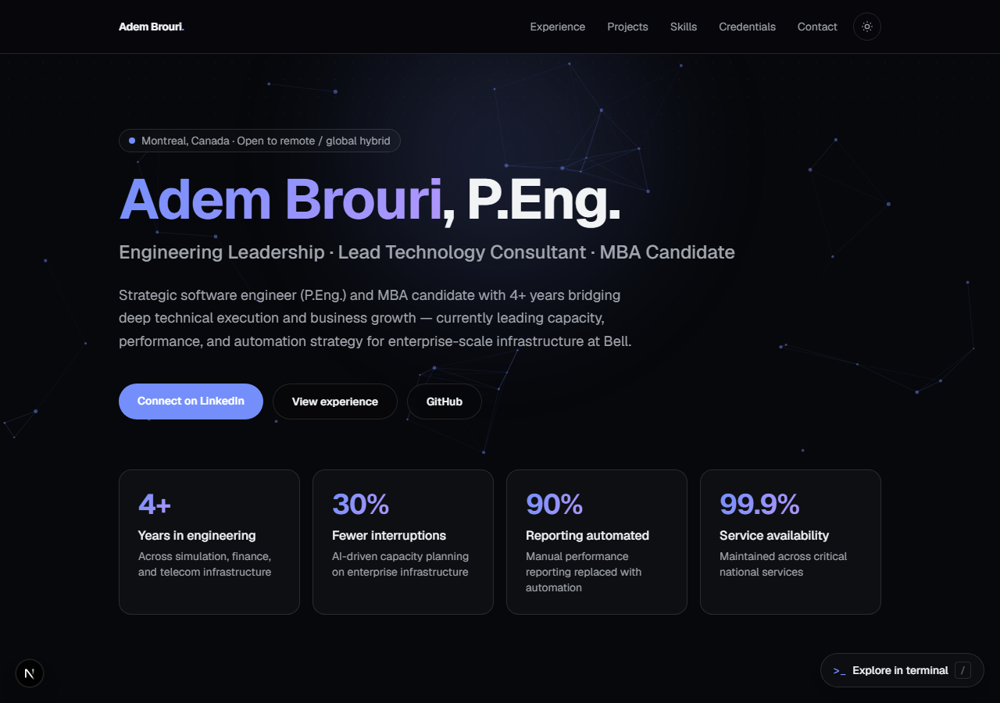

# Portfolio Site

[](https://github.com/doudoumi14/portfolio-site/actions/workflows/ci.yml)

Personal portfolio — a single-page site listing projects, skills, and contact info.



## Stack

Next.js (App Router), TypeScript, Tailwind CSS 4.

## Running locally

```bash
npm install
npm run dev
```

Open `http://localhost:3000`.

## Tests

End-to-end browser tests (Playwright) covering content, repo links, anchor
navigation, and mobile layout:

```bash
npx playwright install chromium
npm run test:e2e
```

## Structure

```
app/            Root layout and the single page
components/     Nav, Hero, Projects, Skills, Contact, Footer
data/           Project list rendered by the Projects section
```

Project cards in `data/projects.ts` link out to their GitHub repos.
