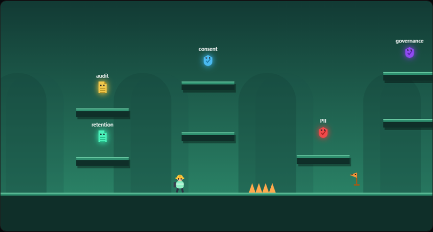

# Portfolio Site

[](https://github.com/doudoumi14/portfolio-site/actions/workflows/ci.yml)

Personal portfolio — a single-page site listing projects, skills, and contact info.


## Stack

Next.js (App Router), TypeScript, Tailwind CSS 4.

## Running locally

```bash
npm install
npm run dev
```

Open `http://localhost:3000`.

## Career mode

The experience section is playable. Each of the four roles is a side-scrolling
level themed to that job — the flight deck at CAE, the automation floor at
Archer, the compliance vault at Desjardins, and the network core at Bell.
Every sprite is the thing it names rather than a generic monster. Pickups are
domain icons chosen to match the label — a gauge for a rate, a shield for
compliance, a gear for automation, a packet for network data, a document for
a record, a spark for raw performance — each in its own hue. The player is an
engineer in a hard hat.
Patrolling and flying enemies can be defeated by landing on them, and each
stage ends with a boss that looks like the problem it is: the Frame Dropper is
a monitor tearing its own picture, the Manual Process is a clipboard of
half-ticked forms with a jittering pen, the Audit Findings is a report under a
magnifier with a red stamp, and Peak Load is a traffic chart spiking into the
red. Beating the boss
clears the level and reveals that role's real outcomes. Progress is kept in
`localStorage`.

The four stages are structurally different, not just recoloured: long runway
jumps at CAE, a rising staircase at Archer, tight vertical chambers at
Desjardins, and wide spans thick with flyers at Bell.



The game is a small canvas engine in `components/game/arcade` — gravity and
AABB collision, a parallax backdrop, particles and screen shake, with keyboard
and touch controls. No game library.


Other interactive pieces: an animated network canvas behind the hero, a
terminal (press `/`) that will print any section of the CV, tilt-on-hover
project cards, and a Konami code.

## Tests

End-to-end browser tests (Playwright) covering content, repo links, anchor
navigation, and mobile layout:

```bash
npx playwright install chromium
npm run test:e2e
```

## Structure

```
app/            Root layout and the single page
components/     Nav, Hero, Projects, Skills, Contact, Footer
data/           Project list rendered by the Projects section
```

Project cards in `data/projects.ts` link out to their GitHub repos.
