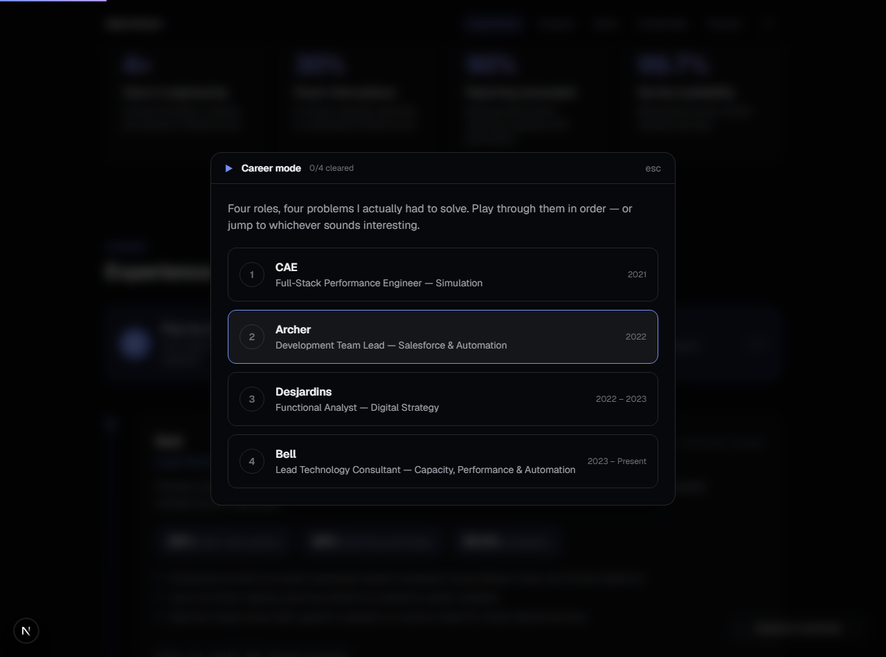
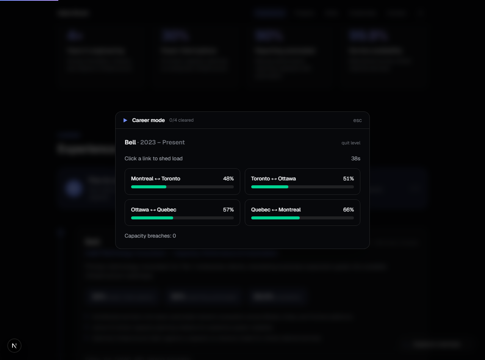

# Portfolio Site

[](https://github.com/doudoumi14/portfolio-site/actions/workflows/ci.yml)

Personal portfolio — a single-page site listing projects, skills, and contact info.


## Stack

Next.js (App Router), TypeScript, Tailwind CSS 4.

## Running locally

```bash
npm install
npm run dev
```

Open `http://localhost:3000`.

## Career mode

The experience section is playable. Each of the four roles is a level with a
minigame built from the problem that job actually involved — frame-budget
optimisation at CAE, assembling an automation pipeline at Archer, backlog
triage at Desjardins, and network capacity routing at Bell. Clearing a level
reveals the real outcomes from that role. Progress is kept in `localStorage`.





Other interactive pieces: an animated network canvas behind the hero, a
terminal (press `/`) that will print any section of the CV, tilt-on-hover
project cards, and a Konami code.

## Tests

End-to-end browser tests (Playwright) covering content, repo links, anchor
navigation, and mobile layout:

```bash
npx playwright install chromium
npm run test:e2e
```

## Structure

```
app/            Root layout and the single page
components/     Nav, Hero, Projects, Skills, Contact, Footer
data/           Project list rendered by the Projects section
```

Project cards in `data/projects.ts` link out to their GitHub repos.
